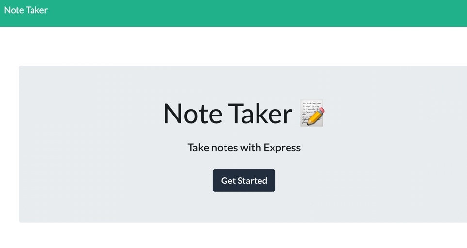
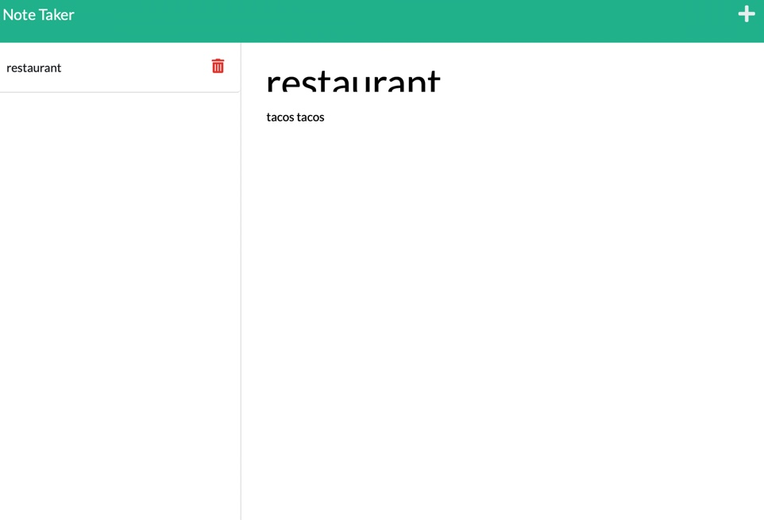

# note-taker

 ##### Description

The Note Taker application helps user keep track of notes in a list. Users can add or delete notes. Notes are saved in the same browser even after refreshing.

- Code `git@github.com:Nahid1010/note-taker.git`
- Heroku`https://notetakerappli.herokuapp.com/`
Installing and running

- Open a terminal.
- Create a directory for this project.
- Change current directory to this project direcory.
- Issue the following command `git@github.com:Nahid1010/note-taker.git`
- If you don't have `node.js` installed already then download it.
- Once installed, use npm to install express package by issuing `npm i express` command at the terminal.
- You can run this program by issuing `node server.js` command.
##### Preview
Here is a preview of the simple useful Note Taker application. 

##### Contact

- Github
 Nahid1010

- Email  nahidmahmud14@yahoo.com
